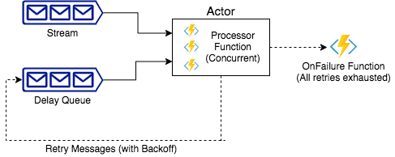

# 💥 Fusion

> WIP

Fusion is a tiny actor library/tool written in `Go`. Fusion provides an actor that consumes
from a stream, calls a registered processor function while applying retries if necessary.

Fusion can be used as a library within a tool for file processing etc, or can be used to
build distributed actor systems using stream/queue implementations based on Kafka, Redis etc.



## Features

* Automatic retries with configurable backoff strategies (Constant, Exponential or custom).
* Streams: Line stream from any `io.Reader`, Kafka stream or custom (Implement `fusion.Stream` interface).
* Delay Queues: In-Memory queue for simple use cases, Redis (WIP) queue for distributed use cases or custom (`fusion.DelayQueue` interface).
* Concurrent workers.

## Usage

### As Library

```go
package main

import (
    "context"
    "os"
    "github.com/spy16/fusion"
    "github.com/spy16/fusion/stream"
)

func main() {
    actor := fusion.New(fusion.Options{
        Workers: 10,
        MaxRetries: 10,
        Stream: &stream.Lines{From: os.Stdin},
        Processor: func(ctx context.Context, msg fusion.Message) error {
            // process message. Returning error triggers retries if possible.
            // can return fusion.Skip to indicate message should be ignored.
            return nil
        },
        OnFailure: func(msg fusion.Message, err error) {
           // message exhausted all retries. push to dead-letter queue or
           // just log it.
        },
    })
    _ = actor.Run(context.Background())
}
```
